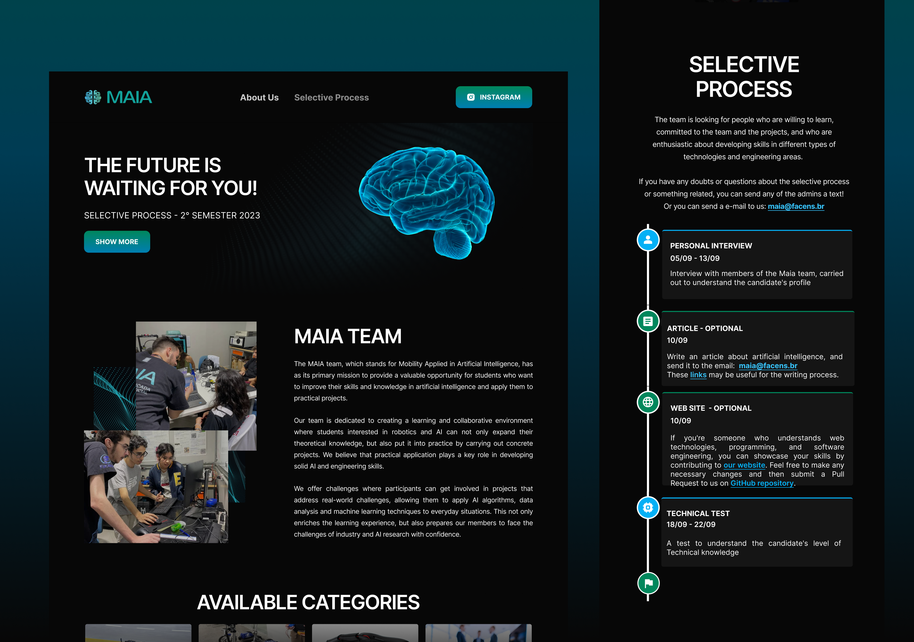

# MAIA Redesign
Landing page criada para um processo seletivo do <a href="https://lince.facens.br/maia-mobilidade-aplicada-e-inteligencia-artificial/" target="_blank">MAIA FACENS</a>.

O MAIA é um subnúcleo do LINCE e tem como objetivo oferecer uma oportunidade ímpar aos alunos de terem contato na prática com tecnologias disruptivas, tais como veículos elétricos, veículos autônomos, algoritmos preditivos, dentre outras Aplicações em Mobilidade e Inteligência Artificial (IA).

Para o desenvolvimento utilizei as seguintes tecnologias: ReactJS, Typescript e CSS.

OBS: Também escrevi um artigo sobre IA para esse processo seletivo [(Clique aqui para ler)](./docs/Article.md)



## Manual de uso
### Inicialiando o site - <a href="http://localhost:5173/" target="_blank">http://localhost:5173/</a>
```sh
npm install
```
```sh
npm run dev
```

## Design - <a href="https://www.figma.com/community/file/1282372531767949969" target="_blank">Abrir no Figma</a>


