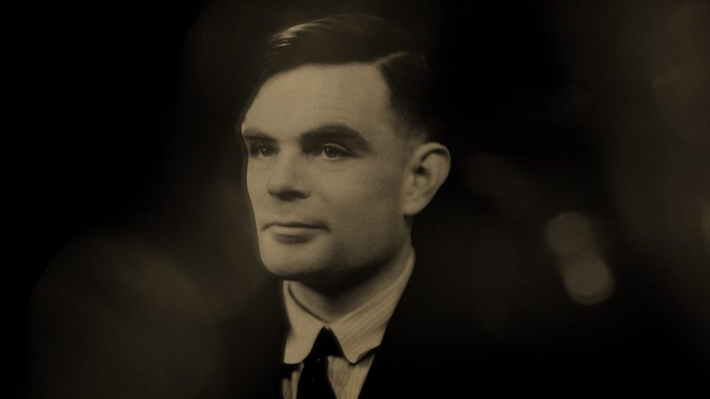

# A Profecia de Alan Turing

Alan Turing, que é considerado o pai da computação, em 1950 publicou um artigo intitulado "Computing Machinery And Intelligence". Neste trabalho, Turing mergulhou profundamente na questão fundamental de se as máquinas poderiam pensar, e descreveu uma teoria visionária.

O artigo tem como ponto central “O Jogo da Imitação”, também conhecido como “Teste de Turing”, no experimento um interrogador humano interage por meio de mensagens escritas com um participante humano e uma máquina, sem poder ver nenhum deles. O objetivo do interrogador é determinar qual é o humano e qual é a máquina baseando-se apenas nas respostas recebidas, se a máquina conseguir enganar o interrogador, fazendo-o acreditar que é um ser humano, ela passa no teste e demonstra um nível de “inteligência” capaz imitar o comportamento humano. 

Na seção "Learning Machines", Turing sugeriu que o processo pelo qual o cérebro cria novas ideias poderia ser comparado a uma "casca de cebola". Ele argumentou que, ao ser apresentado a uma ideia, o cérebro gera menos do que uma ideia em retorno. Porém, como possuimos subcamadas de informações previamente inseridas, podemos conectar essas informações antigas e gerar algo "novo". A partir dessa teoria, Turing propôs uma simulação de uma "mente infantil", que seria submetida à uma educação apropriada, para criar essas subcamadas de informação e, finalmente, desenvolver um cérebro adulto.

Turing propôs que a programação da educação das máquinas fosse baseada em punições e recompensas. Quando um sinal de punição é emitido, a probabilidade de repetir uma ação diminui, enquanto um sinal de recompensa aumenta a probabilidade de repetição da ação. É um processo análogo à evolução.

Essa abordagem visionária inspirou inúmeros debates intelectuais e tentativas de criar máquinas capazes de passar no Teste de Turing. 

Agora, avançando no tempo, chegamos à era do Machine Learning, uma área que desenvolve algoritmos para permitir que as máquinas aprendam com dados, identifiquem padrões e melhorem seu desempenho em tarefas específicas, tudo isso sem a necessidade de programação explícita para cada situação. As abordagens do Machine Learning incluem aprendizado supervisionado, aprendizado não supervisionado e aprendizado por reforço.

É notável a semelhança entre as técnicas usadas nos dias atuais no campo do Machine Learning e as ideias pioneiras de Turing. Isso evidencia a importância duradoura de seu artigo na história da Inteligência Artificial.

## Bibliografia
[A. M. TURING - COMPUTING MACHINERY AND INTELLIGENCE](https://academic.oup.com/mind/article/LIX/236/433/986238)